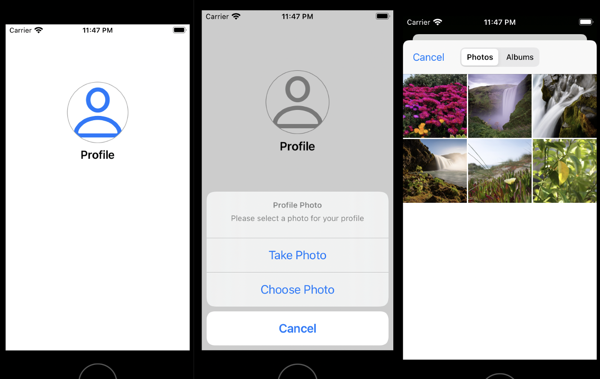
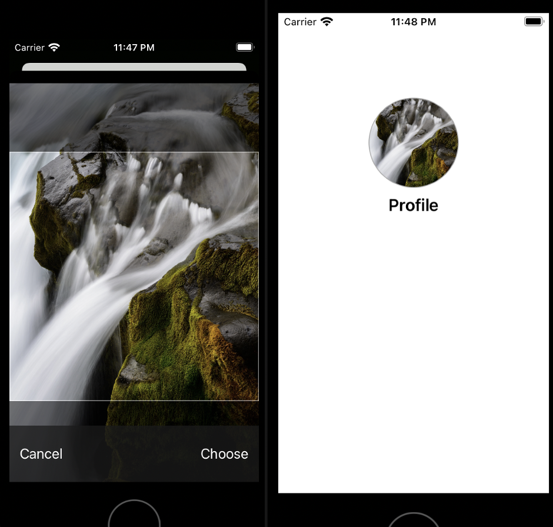

# About
* In this project, I didn't use storyboard. You can see how to use **ImagePicker**.
* Also, the following UIs were used.
    - UIAlertController
    - UITapGestureRecognize
    - UIImageView

# Results
* On Simulator

</img>

</img>

