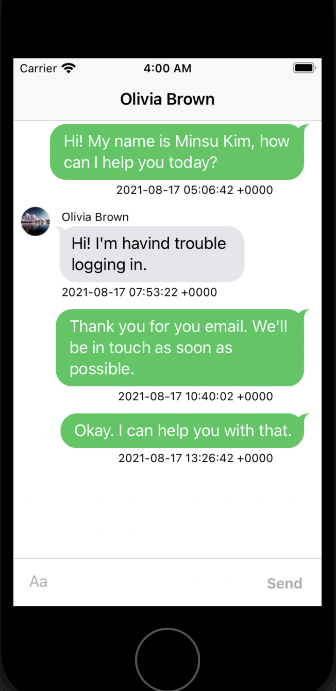
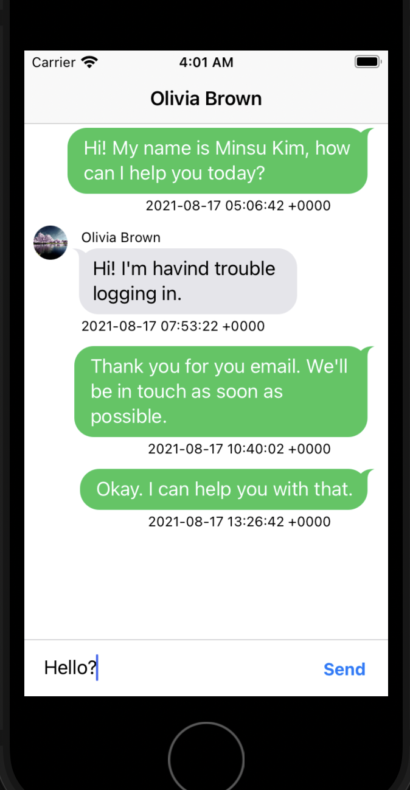
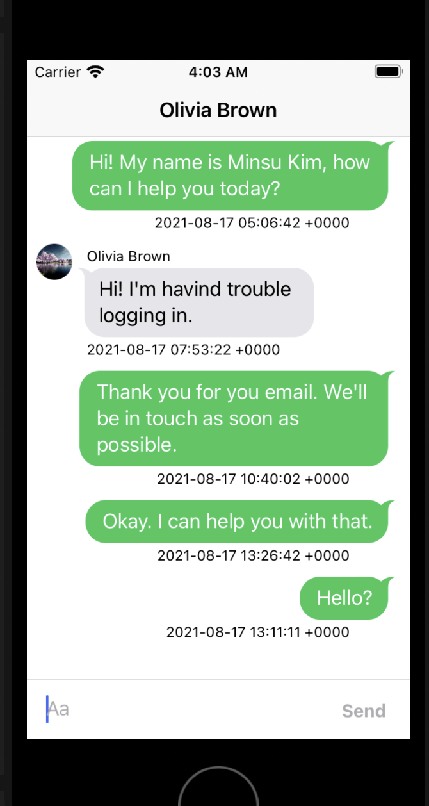

# How to use
* Before you run this project, you should install **Podfile**.
    - If you don't have **Podfile**, then ```pod init```
    - And ```pod install```
    - run ***(yourProjectName).xcworkspace***

* Then, you can see how to work MessageKit.

# Results
* On Simulator
<center></img></center>
<center></img></center>
<center></img></center>

