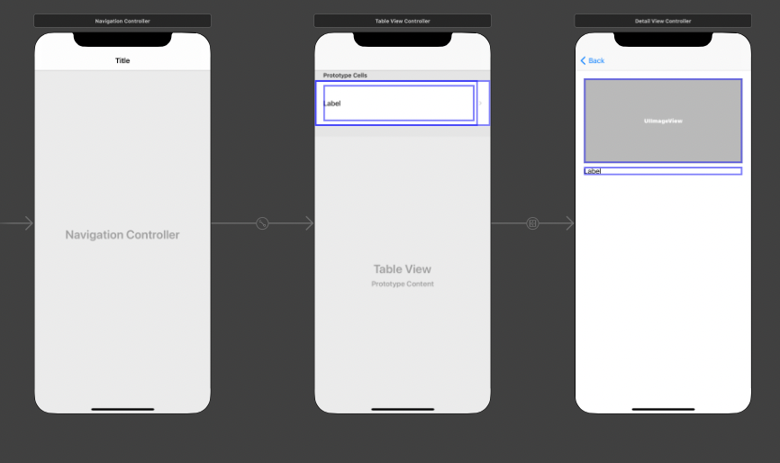

# How to use
* To use this codes, you need to get API key from <https://newsapi.org>
* And in TableViewMain.swift, write **your API** on api variable.
* Then, you can see how to work TableView.

# Results
* In storyboard

</img>

* On Simulator

</img>

</img>

