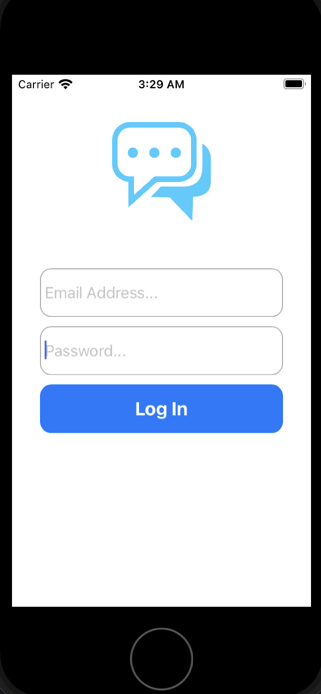
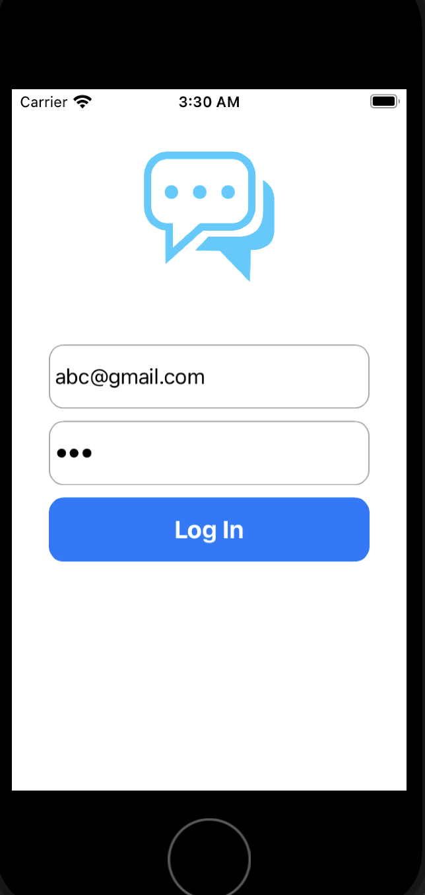
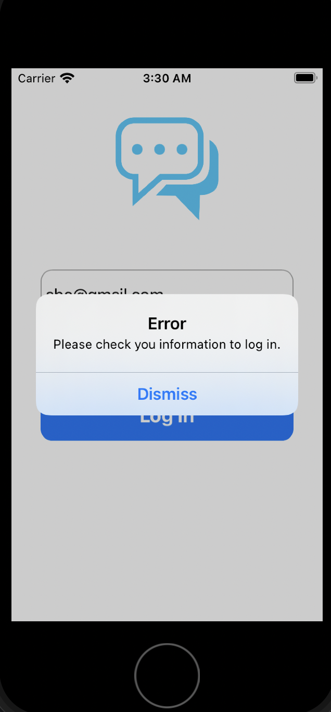

#About
* In this project, I didn't use storyboard. You can see how to use **TextField**.
* Also, 
    - UIAlertController
    - UITapGestureRecognize
    - UIImageView
    - UIScrollView
    - UIButtonr
    - Hiding Keyboard 

# Results
* On Simulator

</img>

</img>

</img>

